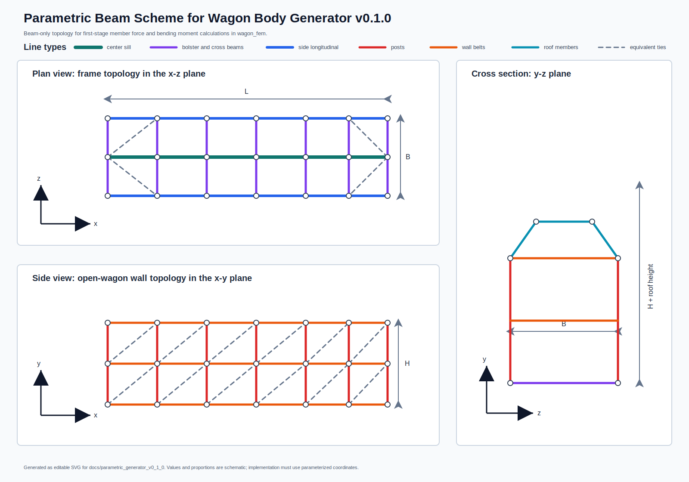
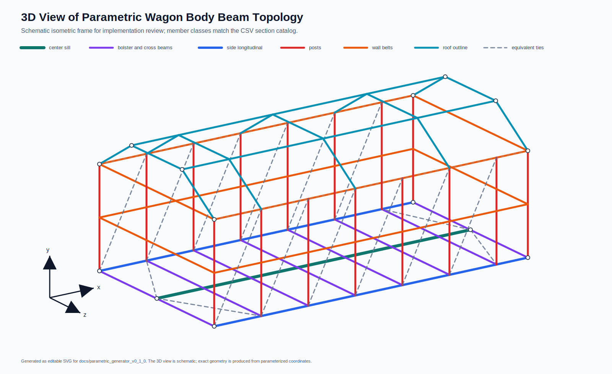
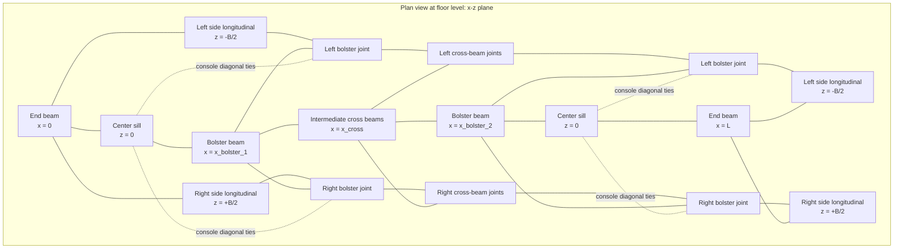
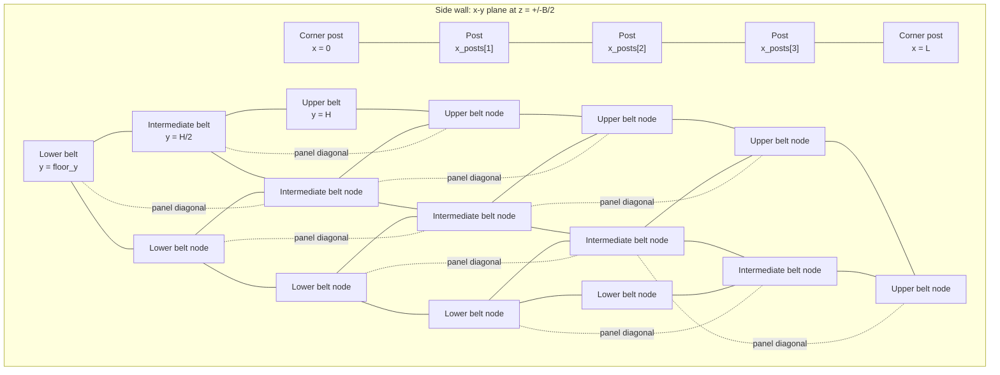
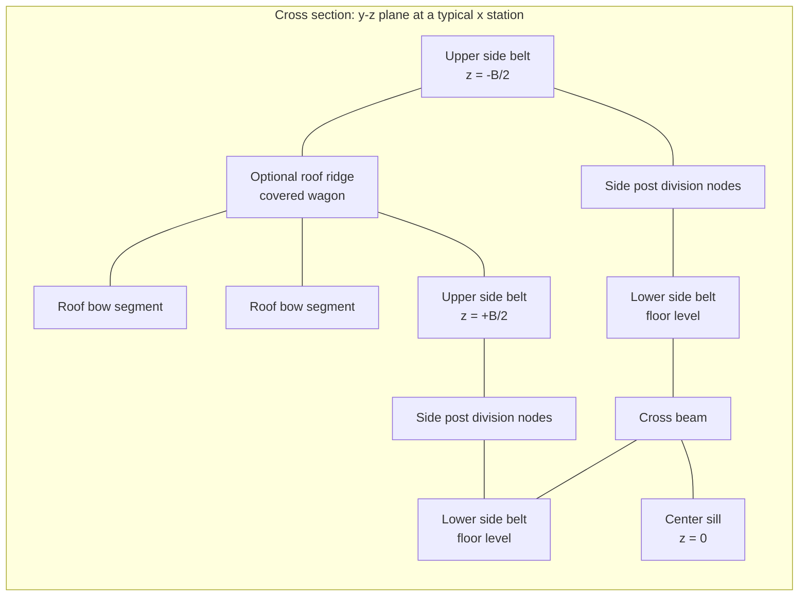

# Body Scheme Illustration

This document gives a visual reference for the proposed first-stage beam scheme. The drawings are conceptual and define topology, member groups, and coordinate logic for implementation.





The first figure shows line types and two-dimensional projections. The second figure gives an isometric three-dimensional view of the same beam topology with a low trapezoidal roof profile.

The figures keep structural labels outside the plotted geometry. The line-type legend defines the visual classes, while the tables below map those classes to `member_tag` and `section_tag` values for implementation.

## Coordinate Convention

```text
          y
          ^
          |
          |
          o------> x
         /
        z
```

- `x`: longitudinal wagon axis.
- `y`: vertical axis.
- `z`: transverse wagon axis.
- `L`: body length.
- `B`: body width.
- `H`: side-wall height.

## Plan View: Frame Topology



### Frame Explanation

The frame grid is generated from `end_positions`, `bolster_positions`, and `x_cross`.

The center sill is the main longitudinal load path. The side longitudinal beams support the lower side-wall belt and participate in transverse load transfer. Bolster beams and end beams create the primary transverse frame lines. Intermediate cross beams define floor support and side-wall connection points. Console diagonal ties transfer part of longitudinal force from the center sill to the side frame.

Recommended member tags:

| Drawing item | `member_tag` | `section_tag` |
|---|---|---|
| Center sill | `center_sill` | `center_sill_heavy` |
| Bolster beam | `bolster_beam` | `bolster_beam_heavy` |
| End beam | `end_beam` | `end_beam_medium` |
| Side longitudinal | `side_longitudinal` | `side_longitudinal_medium` |
| Intermediate cross beam | `cross_beam` | `cross_beam_medium` |
| Console diagonal tie | `diagonal_tie` | `diagonal_tie_equiv` |

## Side View: Open-Wagon Wall Topology



### Side-Wall Explanation

The side wall is generated at both transverse positions, `z = -B/2` and `z = +B/2`.

The lower belt coincides with the side longitudinal beam in the floor frame. Vertical posts are placed at `x_posts`. The wall height is divided by `side_height_divisions`; the drawing shows one intermediate belt for compactness. Equivalent panel diagonals represent in-plane shear transfer from sheathing and provide a practical first-stage substitute for plate action.

Recommended member tags:

| Drawing item | `member_tag` | `section_tag` |
|---|---|---|
| Lower belt | `side_longitudinal` | `side_longitudinal_medium` |
| Upper belt | `upper_belt` | `upper_belt_light` |
| Intermediate belt | `horizontal_belt` | `horizontal_belt_light` |
| Side post | `side_post` | `side_post_light` |
| Panel diagonal | `diagonal_tie` | `diagonal_tie_equiv` |

## Cross Section: Open and Covered Wagon Extension



### Cross-Section Explanation

The open-wagon model uses the lower and upper side-wall belts, vertical posts, and transverse frame beams. The covered-wagon model adds roof side lines, roof bows, and a ridge or top longitudinal line. Roof bows may be represented by two to four straight segments.

Recommended additional member tags for the covered wagon:

| Drawing item | `member_tag` | `section_tag` |
|---|---|---|
| Roof bow | `roof_bow` | `roof_bow_light` |
| Roof longitudinal | `roof_longitudinal` | `roof_longitudinal_light` |
| Door post | `side_post` | `side_post_light` |
| Door lintel | `upper_belt` | `upper_belt_light` |

## Implementation Notes

The generator should create the same topology through coordinate grids instead of hard-coded node identifiers. Each diagram node corresponds to one or more generated `node_id` values, depending on the selected pitch and height division count.

The first-stage export should keep `member_tag` and `section_tag` columns for review and postprocessing. These columns allow moment and force tables to be grouped by structural role after analysis.
