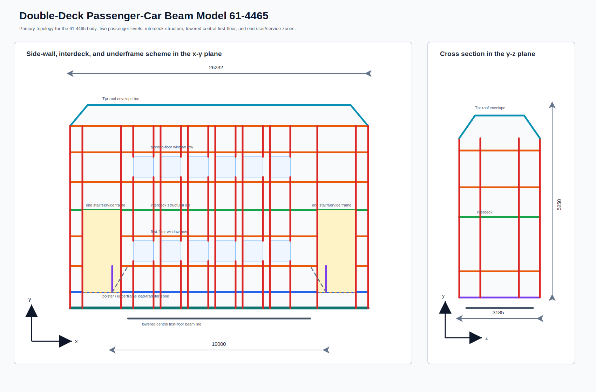
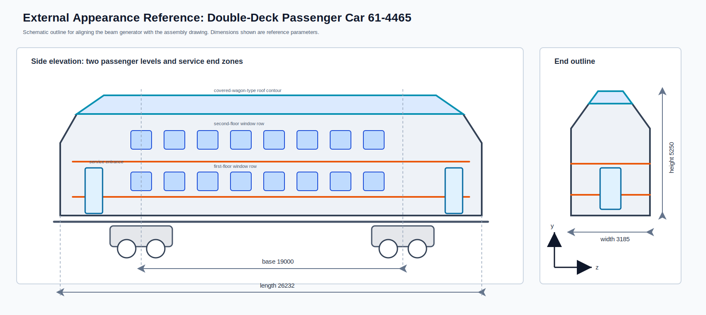
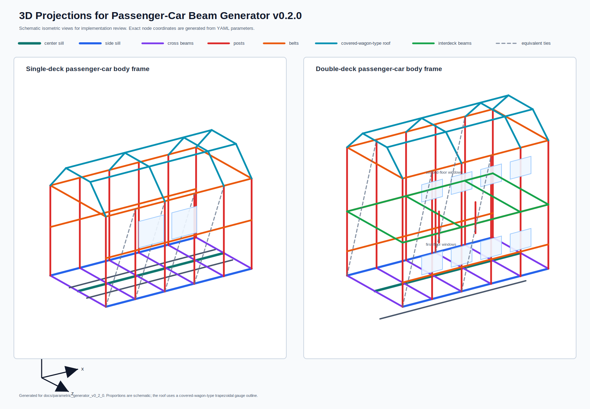
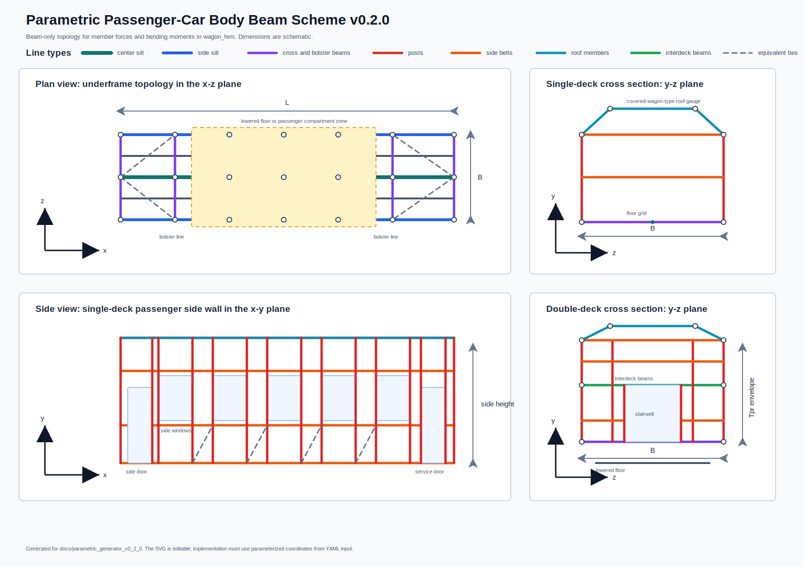

# Body Scheme Illustration

This document gives a visual reference for the passenger-car body-frame topology proposed in `v0.2.0`. The drawing is conceptual and defines coordinate logic, structural groups, opening rules, and the double-deck extension for implementation.









The figure set contains:

- corrected double-deck 61-4465 beam model in the `x-y` and `y-z` planes;
- external 61-4465 reference outline;
- 3D projections of the single-deck and double-deck beam frames;
- separate single-deck passenger-car beam model in the `x-y` and `y-z` planes;
- general passenger-car topology overview.

The single-deck model is checked against KRV chapter 11 in [08_single_deck_krv11_alignment.md](08_single_deck_krv11_alignment.md).

The roof contour uses a covered-wagon-type gauge outline: two inclined roof-bow segments, a short top longitudinal zone, and two side roof rails. This form should be parameterized by `roof_side_y`, `roof_top_y`, and transverse roof-top offsets.

The line-type legend defines the visual classes. The tables below map those classes to `member_tag` values used by the generator and by postprocessing of forces and bending moments.

## Coordinate Convention

```text
          y
          ^
          |
          |
          o------> x
         /
        z
```

`x` is the longitudinal body coordinate.

`y` is the vertical body coordinate.

`z` is the transverse body coordinate.

`L` is the selected body length reference.

`B` is the body width.

`H` is the height used by the selected passenger-car envelope.

## Underframe Topology

The underframe contains a center sill, two side sills, end beams, bolster beams, intermediate cross beams, floor longitudinal beams, and optional diagonal underframe ties.

The plan-view grid is generated from:

- `end_positions`;
- `bolster_positions`;
- `cross_beam_pitch`;
- side-door, end-door, stairwell, and equipment-zone boundaries;
- user-defined additional coordinate stations.

Recommended tags:

| Drawing item | `member_tag` |
|---|---|
| Center sill | `center_sill` |
| Side sill | `side_sill` |
| End beam | `end_beam` |
| Bolster beam | `bolster_beam` |
| Intermediate cross beam | `cross_beam` |
| Floor longitudinal beam | `floor_longitudinal` |
| Underframe diagonal tie | `diagonal_tie` |

## Side-Wall Topology

The side-wall view represents one side of the body at `z = +/-B/2`. The generator mirrors the topology for symmetric parameter files.

The side-wall grid includes:

- lower side belt;
- window-sill belt;
- window-head belt;
- upper side belt;
- regular side posts;
- opening boundary posts;
- equivalent diagonal ties in solid panels;
- omitted panel-equivalent members inside side windows and side doors.

Window and door boundaries are mandatory coordinate stations. Boundary posts and belts around openings remain generated so that the force path around each opening is explicit.

Recommended tags:

| Drawing item | `member_tag` |
|---|---|
| Regular side post | `side_post` |
| Window or door boundary post | `opening_post` |
| Lower side belt | `side_belt_lower` |
| Window-zone belt | `side_belt_window` |
| Upper side belt | `side_belt_upper` |
| Equivalent side-panel tie | `diagonal_tie` |

## Roof and End-Wall Topology

The roof system contains roof side rails, roof bows, a ridge or top longitudinal line, and optional roof longitudinal stiffeners. Roof equipment openings should be framed by local longitudinal and transverse members.

The end walls contain corner posts, main impact posts, end-door boundary members, lower and upper end belts, and roof-transition members. End-wall tags should preserve the distinction between regular end posts and strengthened impact posts.

Recommended tags:

| Drawing item | `member_tag` |
|---|---|
| Roof bow | `roof_bow` |
| Roof longitudinal member | `roof_longitudinal` |
| End-wall post | `end_post` |
| Main impact post | `main_impact_post` |
| End-door boundary member | `opening_post` |

## Double-Deck Extension

The double-deck cross section adds:

- lowered first-floor beams in the central passenger zone;
- interdeck transverse beams;
- interdeck longitudinal beams;
- two side-window belt systems for the first and second passenger levels;
- side-wall posts connecting the lowered floor, interdeck level, upper side belts, and roof rails;
- stairwell boundary frames;
- optional omission of interdeck members inside stairwell openings.

The corrected double-deck side scheme follows the 61-4465 exterior reference. It places the main window rows in the central body span, keeps service and stairwell zones near the ends, and uses strengthened end-transition frames.

Recommended tags:

| Drawing item | `member_tag` |
|---|---|
| Lower-floor member | `cross_beam` or `floor_longitudinal` |
| Interdeck transverse member | `interdeck_cross_beam` |
| Interdeck longitudinal member | `interdeck_longitudinal` |
| Stairwell boundary member | `opening_post` |
| Strengthened transition frame | `side_post` or `cross_beam` with zone metadata |

## 3D Projection Notes

The 3D projections show how the two-dimensional topology is assembled into a spatial beam system.

The single-deck projection contains one main floor grid, one side-window belt system, end-frame lines, and a covered-wagon-type roof contour.

The double-deck projection adds the interdeck beam grid, the lowered-floor line, and stairwell boundary members. These members should be generated from the same coordinate-line system as the two-dimensional scheme.

## External Drawing Reference

The external appearance of the double-deck variant is tied to the local assembly drawing:

```text
/Users/fermi/Library/Mobile Documents/com~apple~CloudDocs/RSTU/Дипломы/Дипломы 2020/ПЗ/Лысаков/Материалы/Диплом/чертежи/4465.00.00.000 Вагон двухэтажный/4465.00.00.000 СБ - Вагон пассажирский  двухэтажный Сборочный чертеж.pdf
```

The drawing is used as a geometric and visual reference for the model 61-4465 exterior. It supports the following default parameters for the double-deck example:

| Parameter | Reference value |
|---|---:|
| Body length reference | `26232 mm` |
| Bogie base | `19000 mm` |
| External width reference | `3185 mm` |
| Height reference | `5250 mm` |

The generated beam model should use these values as traceable defaults while keeping all dimensions editable in the parameter file.

The end outline in the external reference is represented through the transition door, belts, posts, and roof contour. Window openings are concentrated in the side elevation of the double-deck body.

## Implementation Notes

The drawing should be treated as a topology reference. The implementation should generate all coordinates from parameter files and should avoid hard-coded node identifiers.

Every generated member should retain `member_tag` and `section_tag`. These fields make it possible to group finite-element outputs by structural role when comparing moments and forces between body variants.
