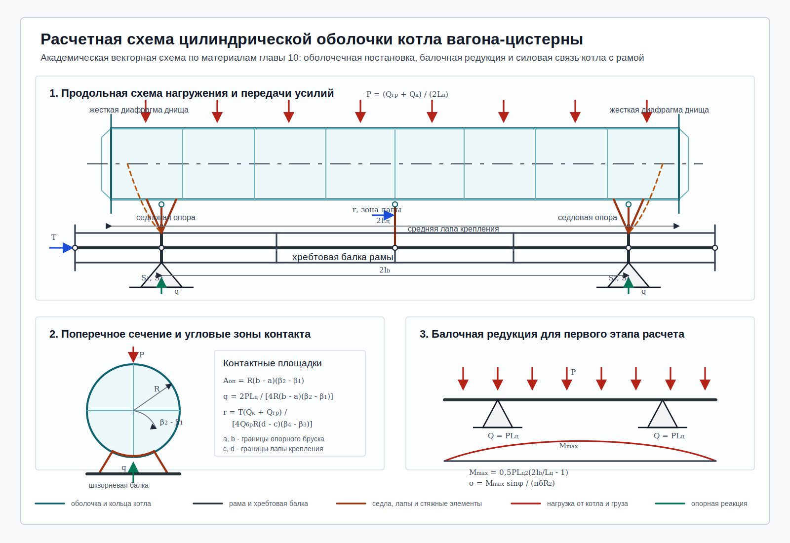

# Академическая расчетная схема цистерны

## Назначение

Иллюстрация показывает расчетную схему цилиндрической оболочки котла вагона-цистерны и ее стержневую интерпретацию для конечно-элементного расчета усилий, изгибающих моментов и опорных реакций.

Основные элементы схемы:

- цилиндрическая оболочка котла с жесткими концевыми диафрагмами;
- эквивалентные кольцевые и продольные балки котла;
- седловые опоры в зонах шкворневых балок;
- средняя лапа крепления котла к хребтовой балке;
- стяжные элементы, ограничивающие вертикальные и поперечные перемещения;
- хребтовая, шкворневые, концевые и поперечные балки рамы;
- опорные реакции в зонах тележек;
- распределенные вертикальные, опорные и продольные контактные нагрузки.

Обозначение `FEM` означает метод конечных элементов.

## Иллюстрация

## Обозначения

| Обозначение | Смысл |
|---|---|
| `P` | интенсивность распределенной вертикальной нагрузки от массы груза и котла |
| `q` | интенсивность опорного давления в зоне седловой опоры |
| `r` | интенсивность продольной контактной нагрузки в зоне лап крепления |
| `T` | продольная сила от ударно-тяговых приборов |
| `Q_гр` | масса перевозимого груза |
| `Q_к` | масса котла |
| `Q_бр` | масса брутто вагона |
| `R` | радиус цилиндрической оболочки котла |
| `2L_ц` | длина цилиндрической части котла |
| `2l_b` | база между расчетными опорами |
| `a, b` | продольные координаты границ опорного бруска |
| `c, d` | продольные координаты границ лапы крепления |
| `β_2 - β_1` | угловая ширина опорной площадки |
| `β_4 - β_3` | угловая ширина площадки продольной связи |
| `S1...S4` | расчетные опоры в зонах шкворневых балок |
| `M_max` | максимальный изгибающий момент балочной редукции |
| `σ` | нормальное напряжение от общего изгиба |

## Расчетная интерпретация

Вертикальная нагрузка `P` задает действие массы котла и груза на цилиндрическую оболочку. В расчетной стержневой модели эта нагрузка прикладывается к узлам или продольным образующим эквивалентной решетки котла. Далее нагрузка передается через седловые опоры к шкворневым балкам, хребтовой балке и опорным точкам тележек.

Опорное давление `q` моделирует контакт котла с опорными брусками или шкворневыми балками. Угловая ширина площадки контакта задается разностью `β_2 - β_1`, а ее продольная протяженность задается координатами `a` и `b`.

Продольная сила `T` прикладывается к концевым узлам хребтовой балки. В зоне средней лапы крепления она формирует распределенную контактную нагрузку `r`, которая позволяет оценить участие котла, хребтовой балки и сопряженных элементов в восприятии продольных усилий.

Балочная редукция применяется как первый этап расчета общего изгиба цилиндрической части котла. Она дает опорные равнодействующие `Q = PL_ц`, максимальный изгибающий момент `M_max` и нормальные напряжения `σ`. Последующий оболочечный расчет уточняет локальное напряженно-деформированное состояние в зонах опор, лап крепления, переходов жесткости и отклонений поперечного сечения от круговой формы.

## Связь с источником `krv_10`

Схема приведена к обозначениям главы 10 из каталога `/Volumes/Data/dev200/rstu/krv_2026/info/krv_10`. В ней сохранены расчетные зависимости для `P`, `q`, `r`, балочной реакции `Q = PL_ц`, максимального момента `M_max` и напряжений от общего изгиба. Дополнительно показаны конструктивные элементы, важные для вагоностроительной интерпретации: седловые опоры, стяжные хомуты, средняя лапа крепления, хребтовая и шкворневые балки.
